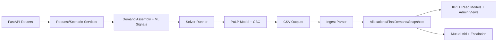

# Disaster Management System Documentation

## 1. Purpose and Scope

This document summarizes the full technical architecture of the project, including:

- system architecture and component boundaries
- backend data models (ORM entities)
- ML and adaptive models
- optimization solver and mathematical formulation
- scenario engine and stress simulation flow
- end-to-end runtime flow across API, services, solver, and ingestion
- key configuration controls and operational behavior

The description is based on source code inspection of the current workspace.

## 2. Technology Stack

- Backend API: FastAPI + SQLAlchemy + Uvicorn
- Database: SQLite (runtime), with Alembic migration support
- Optimization: PuLP model solved by CBC
- Numerical/ML: NumPy, Pandas, custom logistic/ridge-style learning, neural meta-controller
- Frontend: Vite + TypeScript app in frontend/disaster-frontend
- Core optimization and scenario engine: core_engine/phase4

## 3. High-Level System Architecture

The system is organized as five cooperating layers:

1. API Layer
- FastAPI routers receive district/state/national/admin operations.
- Location: backend/app/routers

2. Domain + Service Layer
- Request lifecycle, demand composition, escalation, mutual aid, audit, KPIs, caching.
- Location: backend/app/services

3. Persistence Layer
- SQLAlchemy models store requests, allocations, run snapshots, ML artifacts, scenario artifacts.
- Location: backend/app/models

4. Solver Bridge Layer
- Converts runtime demand/stock into solver files, runs CBC, ingests outputs to relational entities.
- Location: backend/app/engine_bridge

5. Core Engine Layer
- Scenario generators and LP model build/solve pipeline.
- Location: core_engine/phase4

### Architecture Flow (Runtime)

## 4. Backend Data Model Catalog

### 4.1 Operational Core Models

- SolverRun
  - One optimization execution (live or scenario).
  - Stores status, timestamps, demand snapshot path, and model IDs used in run.

- ResourceRequest
  - District demand requests; tracks status and lifecycle fields.
  - Key fields include quantity, priority, urgency, run linkage, included_in_run, unmet/allocated semantics.

- Allocation
  - Persisted solver output per demand slot and source scope.
  - Captures district/state/national sourcing, unmet markers, claim/consume/return quantities.

- FinalDemand
  - Materialized demand fed to solver after baseline-human merge and optional ML weighting.

- InventorySnapshot, ShipmentPlan
  - Persisted solver inventory trajectory and shipment decisions.

### 4.2 Geography and Resource Models

- District, State
- Resource, CanonicalResource
- PoolTransaction, StockRefillTransaction

These models hold district/state geography, resource definitions, and stock adjustments.

### 4.3 Lifecycle and Audit Models

- Claim, Consumption, Return_
- AuditLog
- AgentFinding, AgentRecommendation, AgentActionLog

These represent post-allocation operations, governance traces, and agent advisories.

### 4.4 Scenario Models

- Scenario
- ScenarioRequest
- ScenarioStateStock
- ScenarioNationalStock
- ScenarioExplanation

These manage scenario definitions, demand/stock overrides, and generated explanations.

### 4.5 Mutual Aid Models

- MutualAidRequest
- MutualAidOffer
- StateTransfer

These capture escalation beyond local/state sources and cross-state transfer commitments.

### 4.6 ML/Adaptive Models

- DemandWeightModel, DemandLearningEvent
- PriorityUrgencyModel, PriorityUrgencyEvent, RequestPrediction
- NNModel, NNPrediction, NNFeatureCache, NeuralIncidentLog
- AdaptiveParameter, AdaptiveMetric, MetaControllerSetting

These store training data, learned parameters, inference outputs, and guardrail/audit traces.

## 5. ML and Adaptive Intelligence

## 5.1 Demand Weight Learning

Service: backend/app/services/demand_learning_service.py

Purpose:
- Learn blending of baseline demand and human demand, resource-wise.

Mechanics:
- Maintains weights w_baseline and w_human in DemandWeightModel.
- On merge, if enabled, demand is computed as weighted blend instead of simple sum.
- Captures run outcomes (allocated/unmet/final) as DemandLearningEvent.
- Trains ridge-like 2-feature regression (baseline, human) to refresh weights.

## 5.2 Priority/Urgency Prediction

Service: backend/app/services/priority_urgency_ml_service.py

Purpose:
- Predict effective request priority and urgency when human labels are absent or influence mode allows.

Features include:
- baseline_demand, human_quantity, final_demand, allocated, unmet,
- severity_index, infrastructure_damage_index, population_exposed,
- resource_ethical_priority, human_confidence, time.

Model form:
- Custom logistic model with gradient updates and confidence thresholds.
- Artifacts tracked in PriorityUrgencyModel; per-request outputs in RequestPrediction.

## 5.3 Neural Meta-Controller (LS-NMC)

Services:
- backend/app/services/neural_controller.py
- backend/app/services/ls_nmc_inference_service.py
- backend/app/services/adaptive_guard_layer.py

Purpose:
- Adapt solver control parameters (alpha, beta, gamma, p_mult, u_mult) using learned patterns.

Pipeline:
1. Fetch active prod NNModel weights.
2. Read normalized run features from NNFeatureCache.
3. Run MLP forward pass with ReLU hidden layers + sigmoid output.
4. Map outputs into bounded control ranges.
5. Blend neural and deterministic fallback (influence mode) via configured influence_pct.
6. Validate with guardrails (bounds, drift caps, sanity checks).
7. Persist applied parameter snapshot in AdaptiveParameter.

Safety:
- Guardrails reject unstable outputs.
- Fallback deterministic controller is always available.
- Neural incidents logged in NeuralIncidentLog.

## 5.4 Foundational Phase-3 Model Artifacts

Validation script: core_engine/phase3/06_validation_and_sanity.py

Artifacts loaded from core_engine/models:
- severity/severity_model.pkl
- vulnerability/vulnerability_composite.pkl
- exposure_capacity.pkl
- ai_assisted_demand.pkl

These artifacts provide severity/vulnerability/exposure-demand signals feeding downstream demand computation and feature context.

## 6. Optimization Solver Architecture

## 6.1 Invocation Path

- request_service triggers run_solver in backend/app/engine_bridge/solver_runner.py
- runner executes core_engine/phase4/optimization/just_runs_cbc.py with CLI args
- supports demand and stock override CSVs plus horizon and objective weights

## 6.2 Core LP Build (Phase 8)

File: core_engine/phase4/optimization/build_model_phase8.py

Sets:
- districts D, states S, resources R, time T

Main decision variables:
- inventory inv[d,r,t]
- shipments ship[from,to,r,t]
- state inflow state_in[origin_state,d,r,t]
- national inflow nat_in[d,r,t]
- allocations split by source:
  - alloc_district[d,r,t]
  - alloc_state_by_origin[origin_state,d,r,t]
  - alloc_national[d,r,t]
  - total alloc[d,r,t]
- unmet[d,r,t]

Core constraints:
- allocation decomposition by source
- demand balance: allocation + unmet = demand
- district allocation cap by local inventory
- state/national allocation cap by available inflow
- inventory flow conservation across time
- state stock cap and neighbor export cap
- national stock cap

Objective structure:
- very high penalty on unmet demand
- weighted by time urgency and slot priority/urgency/time_index
- additional costs on holding inventory, shipping, and higher-level sourcing

## 6.3 Mathematical Model (Compact)

Let d in D, r in R, t in T.

Demand balance:

alloc_{d,r,t} + u_{d,r,t} = demand_{d,r,t}

Inventory evolution:

inv_{d,r,t+1} = inv_{d,r,t} + inbound_{d,r,t} + stateIn_{d,r,t} + natIn_{d,r,t} - outbound_{d,r,t} - alloc_{d,r,t}

State and national capacities:

sum(stateIn_{s,*,r,*}) <= cap_state_{s,r}

sum(natIn_{*,r,*}) <= cap_nat_{r}

Objective:

min sum( W_unmet * w_time(t) * w_slot(d,r,t) * u_{d,r,t} )
    + sum( W_hold * inv_{d,r,t} )
    + sum( source_flow_cost * allocations )
    + sum( W_ship * ship_{from,to,r,t} )

Where w_slot combines priority, urgency, and time_index factors.

## 6.4 Output and Ingestion

Generated CSV outputs are parsed by engine_bridge/results_parser.py and ingested by engine_bridge/ingest.py into:

- Allocation
- InventorySnapshot
- ShipmentPlan
- FinalDemand reconciliation
- SolverRun summary snapshot

Ingestion includes:
- source-scope mapping
- unmet classification
- integerization policy preserving slot-level consistency
- transfer provenance and implied delay handling

## 7. End-to-End Runtime Flow

## 7.1 Live Run Flow

1. Request intake
- District requests are stored in ResourceRequest.

2. Run creation and locking
- trigger_live_solver_run creates SolverRun and marks eligible requests as solving.
- solver_execution_lock prevents overlapping solve operations.

3. Demand assembly
- build_live_demand_snapshot builds human demand frame.
- Baseline demand loaded from phase3 output.
- merge_baseline_and_human applies district demand_mode and demand-learning weights.
- Persist to FinalDemand and live demand CSV.

4. Stock assembly
- build_live_stock_override_files composes district/state/national stock override files.
- Optional mutual-aid-aware state stock merge.

5. Solve
- run_solver invokes CBC pipeline.

6. Ingest
- ingest_solver_results writes allocations/snapshots and updates run/request state.

7. Post-solve operations
- request status refresh
- capture demand + priority/urgency learning events
- optional online LS-NMC training
- optional mutual aid escalation from unmet slots
- persist run snapshot summary

## 7.2 Scenario Run Flow

File: backend/app/services/scenario_runner.py

1. Scenario setup
- ScenarioRequest demand signals + optional stock overrides are loaded.

2. Scope shaping
- Baseline demand is filtered to scenario district/resource/time scope.

3. Final demand generation
- Combine baseline + scenario human demand with same weighting pipeline.

4. Solver execution
- run_solver with scenario-specific demand and stock override CSVs.

5. Ingestion and explanation
- Persist outputs, run snapshot, scenario explanation, and recommendations.

6. Optional escalation path
- Mutual aid chain can also run for scenario unmet demand.

## 8. Scenario and Stress Engine

Scenario generators live in core_engine/phase4/scenarios, including:

- S1 zero-demand
- S3 single-district shock
- S4 multi-district intra-state stress
- S5 state-collapse to national escalation
- S6 population skew stress
- A/B/C family scenarios for targeted and regional escalation behavior

These generators produce synthetic demand/stock override CSVs used by the same solver runtime.

## 9. Interconnection Map (What Depends on What)

- API routers -> request_service and scenario_runner
- request_service/scenario_runner -> demand_learning_service + priority_urgency_ml_service + neural_controller
- request_service/scenario_runner -> solver_runner
- solver_runner -> core_engine/phase4/optimization/just_runs_cbc.py
- solver output CSV -> engine_bridge/results_parser -> engine_bridge/ingest
- ingest -> allocation/final_demand/snapshot models
- post-ingest -> mutual_aid_service + training services + run_snapshot_service

## 10. Configuration and Feature Flags

Central config: backend/app/config.py

Key switches:
- ENABLE_DEMAND_LEARNING
- ENABLE_PRIORITY_URGENCY_ML
- ENABLE_NN_META_CONTROLLER
- ENABLE_MUTUAL_AID
- ENABLE_AGENT_ENGINE

Key solver knobs:
- PHASE8_HORIZON
- PHASE8_WEIGHT_UNMET
- PHASE8_WEIGHT_HOLD
- PHASE8_WEIGHT_SHIP
- PHASE8_SOLVER_TIMEOUT_SEC

Operational effect:
- These flags convert the platform between deterministic-only and adaptive modes without changing endpoint contracts.

## 11. Frontend and Read-Model Integration

- Frontend application is in frontend/disaster-frontend.
- Backend main app starts a periodic read-model projector loop (every 10s) to refresh district/state/national snapshots for fast dashboard/API reads.

## 12. Key Files Index

Backend runtime:
- backend/app/main.py
- backend/app/config.py
- backend/app/routers
- backend/app/services/request_service.py
- backend/app/services/scenario_runner.py
- backend/app/services/mutual_aid_service.py

ML/adaptive:
- backend/app/services/demand_learning_service.py
- backend/app/services/priority_urgency_ml_service.py
- backend/app/services/neural_controller.py
- backend/app/services/ls_nmc_inference_service.py
- backend/app/services/ls_nmc_training_service.py
- backend/app/services/adaptive_guard_layer.py

Solver bridge:
- backend/app/engine_bridge/solver_runner.py
- backend/app/engine_bridge/results_parser.py
- backend/app/engine_bridge/ingest.py

Core engine:
- core_engine/phase4/optimization/build_model_phase8.py
- core_engine/phase4/optimization/model_variables.py
- core_engine/phase4/optimization/model_constraints.py
- core_engine/phase4/optimization/model_objective.py
- core_engine/phase4/optimization/just_runs_cbc.py
- core_engine/phase4/scenarios/*

Data models:
- backend/app/models/*

## 12.1 Complete ORM Model File Inventory

The backend model directory currently contains:

- adaptive_metric.py
- adaptive_parameter.py
- agent_action_log.py
- agent_finding.py
- agent_recommendation.py
- allocation.py
- audit_log.py
- canonical_resource.py
- claim.py
- consumption.py
- demand_learning_event.py
- demand_weight_model.py
- district.py
- final_demand.py
- inventory_snapshot.py
- meta_controller_setting.py
- mutual_aid_offer.py
- mutual_aid_request.py
- neural_incident_log.py
- nn_feature_cache.py
- nn_model.py
- nn_prediction.py
- pool_transaction.py
- priority_urgency_event.py
- priority_urgency_model.py
- request.py
- request_prediction.py
- resource.py
- return_.py
- scenario.py
- scenario_explanation.py
- scenario_national_stock.py
- scenario_request.py
- scenario_state_stock.py
- shipment_plan.py
- solver_run.py
- state.py
- state_transfer.py
- stock_refill_transaction.py
- user.py

---

## 13. Executive Summary

This system is a hybrid deterministic + adaptive disaster resource allocation platform.

- Deterministic core: LP optimization in PuLP/CBC with explicit inventory, allocation, unmet, and logistics constraints.
- Adaptive layer: demand blending, priority/urgency inference, and guarded neural meta-control for parameter tuning.
- Governance layer: audit logs, scenario explanations, recommendations, and lifecycle persistence.
- Escalation layer: district -> state -> national with optional neighbor-state mutual aid loop.

The architecture is production-oriented: lock-protected solver runs, durable run artifacts, and post-solve learning loops while preserving deterministic fallback paths.
