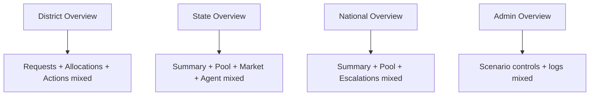

# FRONTEND_IA_REDESIGN_REPORT

## Scope
- Mission type: Presentation-layer IA and UX hardening only.
- Backend/API contracts: Unchanged.
- Solver/data semantics: Unchanged.
- Data shown: Existing API fields or deterministic derived aggregations only.

## Validation Summary
- Frontend unit tests: PASS (`vitest`: 50/50).
- Playwright suite: PASS (`8/8`).
- Console/network checks: PASS in Playwright telemetry assertions (`no 4xx/5xx`, no failed requests).
- Tab navigation exercised: District, State, National, Admin tabbed surfaces validated.

## Before → After IA

### Before
- District/State/National/Admin pages mixed multiple jobs in long stacked sections.
- Limited cross-table interaction patterns; inconsistent filtering/sorting behavior.
- Scattered drilldown patterns.

### After
- Each dashboard now follows tabbed “one mental job per view” IA.
- Shared operations table UX pattern added: search, per-column filter, sortable headers, sticky table headers, pagination, raw JSON row expansion.
- Derived operational insights added from existing numeric fields only.

## IA Diagram (Before)

## IA Diagram (After)

```mermaid
flowchart TD
  D[District Dashboard]
  D --> D0[KPI Cards]
  D --> DT1[Requests]
  D --> DT2[Allocations]
  D --> DT3[Unmet Demand]
  D --> DT4[Agent Recommendations]
  D --> DT5[Run History]

  S[State Dashboard]
  S --> S0[KPI Cards]
  S --> ST1[District Requests]
  S --> ST2[Mutual Aid Allocations]
  S --> ST3[State Stock]
  S --> ST4[Agent Recommendations]
  S --> ST5[Run History]

  N[National Dashboard]
  N --> N0[KPI Cards]
  N --> NT1[State Summaries]
  N --> NT2[National Stock]
  N --> NT3[Inter-State Allocations]
  N --> NT4[Agent Recommendations]
  N --> NT5[Run History]

  A[Admin Dashboard]
  A --> AT1[System Health]
  A --> AT2[Solver Runs]
  A --> AT3[Neural Controller Status]
  A --> AT4[Agent Findings]
  A --> AT5[Audit Logs]
```

## Dashboard-Level Changes

### District
- KPI cards now include: Total Final Demand, Total Allocated, Total Unmet, Coverage %, Runs Freshness.
- Main tabs: Requests, Allocations, Unmet, Agent Recommendations, Run History.
- Requests subtabs: Pending, Allocated, Partial, Unmet, Escalated.
- Added deterministic insights: average delay, top unmet resources.
- Preserved action flows: claim/consume/return, run solver, request resources.

### State
- KPI cards: Total District Demand, Total Allocated to Districts, Total Unmet, Mutual Aid Sent, Mutual Aid Received.
- Tabs: District Requests, Mutual Aid Allocations (Market), State Stock, Agent Recommendations, Run History.
- Added district-level detail toggle flow compatibility and mutual-aid offer action visibility.
- Added top districts by unmet summary.

### National
- KPI cards: National Demand, National Stock, Total Unmet, Inter-State Transfers.
- Tabs: State Summaries, National Stock, Inter-State Allocations, Agent Recommendations, Run History.
- Added top states by unmet insight.

### Admin
- Tabs: System Health, Solver Runs, Neural Controller Status, Agent Findings, Audit Logs.
- Preserved existing scenario studio and preview behavior under System Health.
- Added tabbed visibility for run logs/analysis, derived neural status view, and browser-local audit log view.

## Required UX Enhancements Implemented
- Column sorting: Yes.
- Column filtering: Yes.
- Search box: Yes.
- Sticky headers: Yes.
- Pagination: Yes.
- Expand row with raw JSON (read-only): Yes.

## Field Mapping (Old → New Location)
| Old surface | New tab/location |
|---|---|
| District request summary table | District → Requests (status subtabs) |
| District allocation action rows | District → Allocations |
| District unmet rows | District → Unmet Demand |
| District run metadata | District → Run History |
| State allocation summary | State → District Requests |
| State mutual-aid market cards | State → Mutual Aid Allocations |
| State pool rows | State → State Stock |
| State agent table | State → Agent Recommendations |
| National allocation summary | National → State Summaries |
| National stock | National → National Stock |
| National pool transactions | National → Inter-State Allocations |
| Admin run logs + analysis | Admin → Solver Runs |
| Admin agent recommendations | Admin → Agent Findings |

## Modified Frontend Files
- `frontend/disaster-frontend/src/dashboards/shared/OpsDataTable.tsx` (new)
- `frontend/disaster-frontend/src/dashboards/district/DistrictOverview.tsx`
- `frontend/disaster-frontend/src/dashboards/state/StateOverview.tsx`
- `frontend/disaster-frontend/src/dashboards/national/NationalOverview.tsx`
- `frontend/disaster-frontend/src/dashboards/admin/AdminOverview.tsx`

## Screenshots
- Old layout screenshots: Not explicitly available as versioned baseline artifacts in current workspace.
- New layout screenshots/evidence (Playwright):
  - `frontend/disaster-frontend/test-results/district-overview-and-request-log.png`
  - `frontend/disaster-frontend/test-results/state-mutual-aid-offer.png`
  - `frontend/disaster-frontend/test-results/state-overview-district-detail-toggle.png`
  - `frontend/disaster-frontend/test-results/national-overview-and-requests.png`
  - `frontend/disaster-frontend/test-results/admin-navigation-stress-smoke.png`

## Contract Safety Confirmation
- Backend files changed: **No** (this IA redesign modified frontend files only).
- API endpoint contracts changed: **No**.
- Data semantics changed: **No**.
