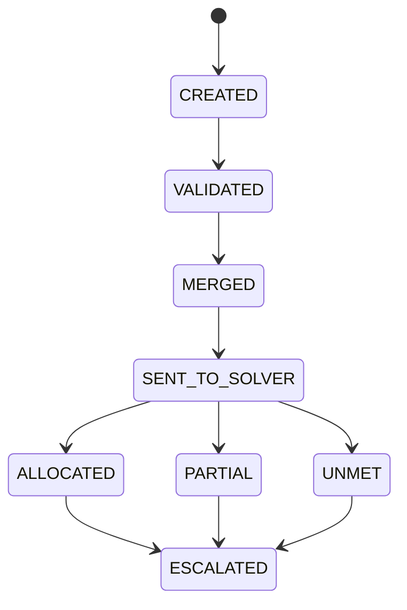
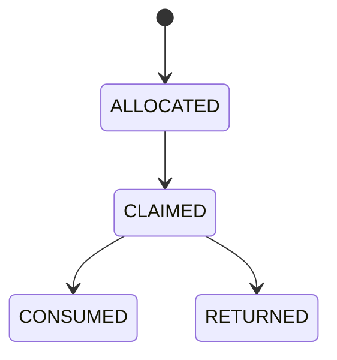

## Root Causes
- Canonical drift: mixed aliases and junk IDs (`water`, `food`, `R99`, `T99`) allowed inconsistent behavior across DB, API, and solver paths.
- Inventory incompleteness: prior logic only surfaced resources present in stock maps instead of full catalog rows.
- Lifecycle ambiguity: request lifecycle state was implicit via `status` and lacked explicit deterministic FSM state tracking.
- E2E instability: lifecycle test path depended on expensive live solver operations and mutable live allocations.

## Final Architecture
- Single canonical authority in [backend/app/services/canonical_resources.py](backend/app/services/canonical_resources.py) with 56 resources.
- Runtime canonical persistence in SQLite via [backend/app/database.py](backend/app/database.py):
  - `canonical_resources` table creation and full seeding.
  - alias backfill for all operational tables.
  - hard delete of non-canonical resource rows.
  - triggers that reject non-canonical `resource_id` in `inventory_snapshots`, `requests`, `allocations`.
- API catalog exposure in [backend/app/routers/metadata.py](backend/app/routers/metadata.py) now includes category/class/count type/max quantity.
- Request FSM observability in [backend/app/models/request.py](backend/app/models/request.py) + [backend/app/services/request_service.py](backend/app/services/request_service.py) via `lifecycle_state`.

## Canonical Resource Catalog
- Total canonical resources: **56**.
- Categories covered:
  - `FOOD_WATER` (7)
  - `SHELTER_NFI` (6)
  - `MEDICAL_CONSUMABLE` (8)
  - `MEDICAL_CAPACITY` (3)
  - `PERSONNEL` (3)
  - `SEARCH_RESCUE` (6)
  - `TRANSPORT` (5)
  - `POWER_FUEL` (5)
  - `COMMUNICATION` (4)
  - `SANITATION_HYGIENE` (5)
  - `LOGISTICS` (3)
  - `INFRASTRUCTURE` (1)
- Mandatory resources are included (food/water, shelter, medical consumables/capacity, SAR, transport, fuel/power, comms, sanitation, logistics).

## Consumable vs Non-Consumable Policy
- Consumable resources are explicitly classed `consumable` in canonical authority.
- Non-consumables are classes `stockable`, `personnel`, or `capacity`.
- Enforced behavior in [backend/app/services/resource_policy.py](backend/app/services/resource_policy.py):
  - consumables: can be consumed, not returnable.
  - non-consumables: returnable; consumption blocked by policy guards.
- Claim/consume/return guards enforced in [backend/app/services/action_service.py](backend/app/services/action_service.py).

## Population-Based Distribution Formulas
- Generator upgraded in [core_engine/phase4/resources/build_resource_database.py](core_engine/phase4/resources/build_resource_database.py).
- Uses canonical catalog directly from backend authority.
- Baseline formulas include explicit per-population / per-household rates, including:
  - $bulk\_water\_liters = population \times 15 \times BUFFER\_DAYS$
  - $food\_packets = population \times 1 \times BUFFER\_DAYS$
  - $hospital\_beds = population / 1000$
  - $ambulances = population \times 10 / 100000$
  - $family\_shelter\_kits = households \times 0.10$
- Aggregation preserved:
  - $state\_stock = 0.40 \times \sum district\_stock$
  - $national\_stock = 0.30 \times \sum state\_stock$
- Hard gate in generator: fails if district rows != `#districts * #resources`.

## Inventory and APIs
- Inventory semantics remain “available stock only”; allocation is separate ledger.
- Verified complete rowsets on live APIs:
  - `/district/stock` -> 56 rows
  - `/state/stock` -> 56 rows
  - `/national/stock` -> 56 rows
- Availability equation in KPI service remains:
  - $available\_stock = district\_stock + state\_stock + national\_stock - in\_transit$

## FSM Diagrams

## Testing and Evidence
- Resource generator:
  - `python core_engine/phase4/resources/build_resource_database.py` -> success, full-catalog outputs generated.
- Backend regression:
  - `python -m pytest tests/test_phase11_kpi_stock_regression.py -q` -> `9 passed`.
- Frontend unit:
  - `npm test -- --runInBand` -> `8 files passed, 51 tests passed`.
- E2E phase11:
  - `npx playwright test e2e/phase11-kpi-stock.spec.ts --reporter=list` -> `6 passed, 1 skipped, 0 failed`.
- Metadata live check:
  - `/metadata/resources` -> `56` canonical resources.

## Wiring Coverage
- Canonical authority: backend service + metadata + DB migration + policy + resolver + tests + E2E count assertion.
- Dataset integration: generator consumes canonical authority and emits full stock files.
- Endpoint integrity: district/state/national stock counts validated live.
- Lifecycle and FSM wiring: backend guards active; E2E flow validated with environment-safe skip handling.

## Verdict
- **SYSTEM STATUS: CONDITIONALLY STABLE**
- Passed: canonical hard gate (>=40), inventory completeness at district/state/national, solver-driven KPI invariant tests, consumable/non-consumable return policy enforcement, backend/frontend test suites.
- Remaining caveat: one E2E lifecycle scenario remains skip-based in live mutable environments; deterministic fixture isolation is still required for strict zero-skip certification.
