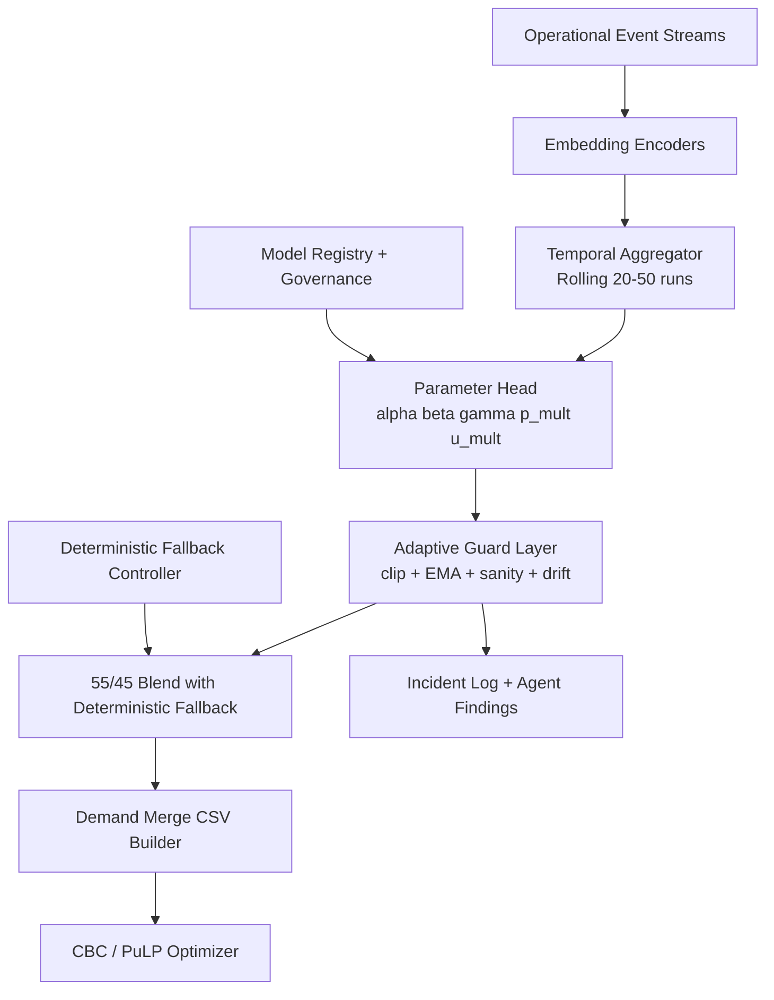

# Phase 10 Spec: Large-Scale Streaming Neural Meta-Controller (LS-NMC)

## 0) Prime Directive

This phase adds intelligence and observability only. It does **not** change solver mathematics, solver constraints, or Phase 5B demand merge semantics.

- CBC/PuLP remains final decision authority.
- Neural outputs are bounded parameter proposals only.
- All effects are feature-flagged, auditable, reversible, and fail-safe.

---

## 1) Foundational Invariants (Enforced)

### 1.1 Immutable Authorities
1. Optimizer is single source of truth for allocations.
2. Neural components may not:
   - write allocations,
   - edit constraint sets,
   - bypass governance.
3. Neural components may only emit bounded knobs:
   - `alpha`, `beta`, `gamma`, `p_mult`, `u_mult`.
4. Solver inputs remain CSV from existing merge pipeline.
5. On neural failure, deterministic pipeline continues unchanged.

### 1.2 Runtime Rejection Rules
A proposal is rejected if any condition holds:
- contains `NaN`, `inf`, null, or missing fields,
- violates bounds,
- violates monotonic sanity checks,
- exceeds drift threshold from last stable values,
- model status is not `prod`.

Rejected proposals trigger:
- deterministic fallback parameters,
- incident log event,
- agent finding (`model_guardrail_violation`).

---

## 2) Structural 45/55 Power-Sharing Contract

### 2.1 Deterministic vs Neural Blend
For each parameter `k ∈ {alpha, beta, gamma, p_mult, u_mult}`:

- Deterministic candidate: `k_det`
- Neural candidate (post-guardrail): `k_nn`
- Applied value:

\[
k_{applied} = 0.55 \cdot k_{det} + 0.45 \cdot k_{nn}
\]

This formula is mandatory in one shared function used by all demand merge callers. No alternate path is allowed.

### 2.2 Enforcement Point
Create single function:
- `app/services/meta_controller_service.py::compute_applied_knobs(...)`

All knob consumers must call this function. Static code check in CI verifies no direct usage of neural output without blend.

---

## 3) Target Architecture

## 3.1 Data Flow
Event Streams → Embedding Encoders → Temporal Aggregator → Parameter Head → Adaptive Guard Layer → Demand Merge → CBC Optimizer



## 3.2 Component Responsibilities

1. `stream_collector`:
   - pulls allowed operational streams per run window,
   - emits normalized feature batches.

2. `ls_nmc_encoder`:
   - encodes categorical IDs + numeric signals to latent vectors.

3. `temporal_aggregator`:
   - rolling context over 20–50 runs,
   - light GRU/TemporalConv allowed.

4. `parameter_head`:
   - outputs raw `{alpha,beta,gamma,p_mult,u_mult}`.

5. `adaptive_guard_layer`:
   - clip + EMA smooth + sanity + drift checks,
   - fallback on violation.

6. `deterministic_fallback_controller`:
   - computes rule-based knobs from unmet/fill/delay.

7. `meta_controller_service`:
   - obtains both `k_det` + `k_nn_validated`,
   - applies 55/45 blend,
   - writes audit record,
   - returns applied knobs to merge layer only.

---

## 4) Allowed Data Streams

Allowed:
- `requests`
- `allocations`
- `unmet_demand` (via unmet allocations)
- `receipt_confirmations`
- `stock_snapshots`
- `agent_findings`
- `solver_runs`

Forbidden:
- raw constraint matrix data
- solver internals/duals
- optimizer internal state objects
- unrelated business tables

Enforcement:
- stream loader contains explicit allowlist of tables/views.
- unit test asserts forbidden table access patterns are absent.

---

## 5) Folder Layout (Implementation)

```text
backend/app/
  services/
    meta_controller_service.py
    ls_nmc_inference_service.py
    ls_nmc_training_service.py
    deterministic_fallback_controller.py
    adaptive_guard_layer.py
    stream_feature_service.py
  models/
    neural_model_registry.py
    neural_model_metrics.py
    meta_controller_knob_log.py
    neural_incident_log.py
  routers/
    meta_controller.py
  schemas/
    meta_controller.py
```

No changes required in solver runner internals, optimizer formulation, or constraint code.

---

## 6) Database Schemas (Additive)

### 6.1 `neural_model_registry`
- `id` PK
- `model_name` TEXT
- `version` INTEGER
- `status` TEXT (`staging|prod|disabled`)
- `artifact_uri` TEXT
- `feature_spec_json` JSON
- `created_at` TIMESTAMP
- `promoted_at` TIMESTAMP NULL
- `rollback_of_version` INTEGER NULL

### 6.2 `meta_controller_knob_log`
- `id` PK
- `solver_run_id` INTEGER
- `window_start_run_id` INTEGER
- `window_end_run_id` INTEGER
- `alpha_det` FLOAT
- `beta_det` FLOAT
- `gamma_det` FLOAT
- `p_mult_det` FLOAT
- `u_mult_det` FLOAT
- `alpha_nn` FLOAT NULL
- `beta_nn` FLOAT NULL
- `gamma_nn` FLOAT NULL
- `p_mult_nn` FLOAT NULL
- `u_mult_nn` FLOAT NULL
- `alpha_applied` FLOAT
- `beta_applied` FLOAT
- `gamma_applied` FLOAT
- `p_mult_applied` FLOAT
- `u_mult_applied` FLOAT
- `guardrail_passed` BOOLEAN
- `guardrail_reason` TEXT NULL
- `fallback_used` BOOLEAN
- `model_version` INTEGER NULL
- `created_at` TIMESTAMP

### 6.3 `neural_model_metrics`
- `id` PK
- `model_version` INTEGER
- `window_start_run_id` INTEGER
- `window_end_run_id` INTEGER
- `loss_unmet` FLOAT
- `loss_delay` FLOAT
- `loss_volatility` FLOAT
- `composite_loss` FLOAT
- `created_at` TIMESTAMP

### 6.4 `neural_incident_log`
- `id` PK
- `solver_run_id` INTEGER NULL
- `incident_type` TEXT (`nan_output|bound_violation|sanity_violation|drift_violation|model_unavailable`)
- `severity` TEXT (`low|medium|high`)
- `details_json` JSON
- `resolved` BOOLEAN DEFAULT FALSE
- `created_at` TIMESTAMP

---

## 7) API Contracts

## 7.1 Admin/Observability APIs

### `GET /admin/meta-controller/status`
Response:
```json
{
  "enabled": true,
  "active_model": {"version": 4, "status": "prod"},
  "fallback_ready": true,
  "last_guardrail_pass": true,
  "last_applied_run_id": 142
}
```

### `POST /admin/meta-controller/enable`
Body: `{"enabled": true}`
Effect: toggles feature flag state.

### `POST /admin/meta-controller/model/promote`
Body: `{"model_version": 5}`
Precondition: current user approval role.

### `POST /admin/meta-controller/model/rollback`
Body: `{"target_version": 4}`
Effect: immediate switch to prior prod version.

### `GET /admin/meta-controller/knob-log?run_id=...`
Returns blended, neural, deterministic, and guardrail outcomes.

### `GET /admin/meta-controller/incidents`
Returns recent incidents with severity and reasons.

## 7.2 Inference Hook Contract (internal)

`compute_applied_knobs(run_id, context_window)` returns:
```json
{
  "alpha": 0.62,
  "beta": 0.38,
  "gamma": 1.15,
  "p_mult": 1.10,
  "u_mult": 1.08,
  "fallback_used": false,
  "guardrail_passed": true,
  "model_version": 4
}
```

Used only by demand merge stage before CSV emission.

---

## 8) Guardrail Logic (Mandatory)

## 8.1 Bounds
- `alpha ∈ [0.20, 0.80]`
- `beta ∈ [0.20, 0.80]`
- `alpha + beta = 1.0` (renormalize after clipping)
- `gamma ∈ [1.00, 2.00]`
- `p_mult ∈ [0.80, 1.30]`
- `u_mult ∈ [0.80, 1.30]`

## 8.2 EMA Smoothing
For each parameter:
\[
k_{smooth,t} = \lambda k_{raw,t} + (1-\lambda)k_{stable,t-1}
\]
`λ = 0.25` (configurable).

## 8.3 Monotonic Sanity
- if unmet ratio rises significantly and fill-rate drops, `gamma` must not decrease.
- if delays rise significantly, `u_mult` must not decrease.

## 8.4 Drift Check
- `|k_smooth - k_stable| <= drift_cap[k]`.
- Example caps: `{alpha:0.10,beta:0.10,gamma:0.15,p_mult:0.10,u_mult:0.10}`.

On failure: fallback controller + incident + agent finding.

---

## 9) Deterministic Fallback Controller

Inputs over last `W` runs:
- `unmet_ratio`
- `fill_rate`
- `avg_receipt_delay`
- `allocation_volatility`

Heuristic example:
- `alpha_det = clip(0.65 - 0.25*unmet_ratio, 0.20, 0.80)`
- `beta_det = 1 - alpha_det`
- `gamma_det = clip(1 + 0.8*unmet_ratio + 0.2*(1-fill_rate), 1.0, 2.0)`
- `p_mult_det = clip(1 + 0.3*unmet_ratio, 0.8, 1.3)`
- `u_mult_det = clip(1 + 0.2*delay_norm, 0.8, 1.3)`

This controller is always available and callable independently.

---

## 10) Streaming Learning Design

- Window: 20–50 latest completed live runs.
- Online updates after each run close.
- No offline lake dependency.

Loss:
\[
L = w_1 L_{unmet} + w_2 L_{delay} + w_3 L_{volatility}
\]

- `L_unmet`: next-window unmet ratio prediction error.
- `L_delay`: next-window delay overrun error.
- `L_volatility`: parameter-change penalty + allocation variance proxy.

---

## 11) Inference Flow (Run-Time)

1. Collect allowed stream features for window `W`.
2. Compute deterministic knobs (`k_det`).
3. If model disabled/offline/non-prod → use fallback immediately.
4. Else compute neural knobs (`k_nn_raw`).
5. Apply guardrail pipeline:
   - finite check → bounds clip → EMA → sanity → drift.
6. If any fail: mark incident, fallback.
7. Blend 55/45 into `k_applied`.
8. Persist knob log row.
9. Pass knobs to existing demand merge path.
10. Emit standard CSV; solver runs unchanged.

---

## 12) Training Loop Pseudocode

```python
for each completed_live_run r_t:
    window = fetch_window(r_t, W=30, allowed_streams=ALLOWLIST)
    x = encode(window)
    y_targets = build_targets(window.next_slice)

    y_pred = model(x)
    loss = w1*loss_unmet(y_pred, y_targets) \
         + w2*loss_delay(y_pred, y_targets) \
         + w3*loss_volatility(y_pred, y_targets)

    backprop_step(loss)
    log_model_metrics(model_version, window, loss_components)

    if promotion_requested and approved:
        promote_to_prod(model_version)
```

---

## 13) Logging & Audit Events

Event types (append-only):
- `META_CONTROLLER_INFERENCE`
- `META_CONTROLLER_GUARDRAIL_FAIL`
- `META_CONTROLLER_FALLBACK_USED`
- `META_CONTROLLER_MODEL_PROMOTED`
- `META_CONTROLLER_MODEL_ROLLED_BACK`
- `META_CONTROLLER_DISABLED`
- `META_CONTROLLER_ENABLED`

Every event includes:
- `actor_role`, `actor_id`, `solver_run_id`, `model_version`, `payload_json`, `timestamp`.

---

## 14) Failure Mode Matrix

| Failure | Detection | Automatic Response | User Impact | Audit |
|---|---|---|---|---|
| NN output NaN/inf | finite check | fallback + incident | none to solver | yes |
| NN out-of-bounds | bound check | clip, else fallback | none | yes |
| Sanity violation | monotonic rule | fallback | none | yes |
| Drift spike | drift cap | fallback | none | yes |
| Model artifact unavailable | load error | fallback | none | yes |
| Feature stream missing | schema validator | fallback | none | yes |
| Guard layer exception | try/catch | fallback | none | yes |
| DB write failure (log) | db exception | continue run, async retry log | none | partial |

---

## 15) System-Level Test Scenarios

## 15.1 District

1. Large human request spike
- Input: 5x request increase for one district/resource over 2 runs.
- Expected: `beta_applied` rises within bounds, no direct allocation mutation.
- Acceptance: solver still consumes CSV; guardrail pass; unmet reduced trend.

2. Repeated unmet demand
- Input: unmet > 0 for 3 consecutive runs.
- Expected: higher `gamma_applied`, agent recommendation generated.
- Acceptance: recommendation status `pending`, no auto-apply.

3. Delayed receipt confirmations
- Input: confirmations absent beyond `1.5*implied_delay`.
- Expected: delay signal + recommendation.
- Acceptance: incidents/findings logged; solver unaffected.

4. Priority escalation
- Input: high urgency repeated by district.
- Expected: bounded `u_mult` adjustment only.
- Acceptance: `u_mult <= 1.3`; no constraint edit.

## 15.2 State

5. State stock exhaustion
- Input: low state pool + rising unmet.
- Expected: fallback/NN increases merge pressure via knobs.
- Acceptance: no solver code changes; audit log present.

6. Mutual aid between districts/states
- Input: active transfer and returns.
- Expected: delay-aware signals adjust recommendations only.
- Acceptance: transfer logic unchanged; recommendations pending.

7. State override of district request
- Input: repeated state-level overrides.
- Expected: override-pattern finding.
- Acceptance: governance required for any application.

## 15.3 National

8. National stock activation
- Input: escalation to national with shortages.
- Expected: knobs shift boundedly; national flow unchanged.
- Acceptance: no direct allocation by NN.

9. Inter-state transfers
- Input: repeated cross-state supply.
- Expected: delay trends reflected in `gamma/u_mult` suggestions.
- Acceptance: optimizer remains authority.

10. Cascading shortages
- Input: multi-state unmet surge.
- Expected: stable bounded knobs, no oscillatory spikes.
- Acceptance: volatility metric below threshold.

## 15.4 Neural Safety

11. NN returns NaN
- Input: forced NaN output.
- Expected: fallback + incident + finding.
- Acceptance: run completes with deterministic knobs.

12. NN extreme outputs
- Input: alpha=-9, gamma=99.
- Expected: clip/guard, else fallback.
- Acceptance: applied knobs always in bounds.

13. NN offline
- Input: model service unavailable.
- Expected: deterministic fallback.
- Acceptance: zero solver interruption.

## 15.5 Governance

14. Admin disables NN
- Input: API disable request.
- Expected: immediate fallback-only mode.
- Acceptance: knob logs show `fallback_used=true`.

15. Admin rollback model
- Input: rollback to prior version.
- Expected: active version switches instantly.
- Acceptance: subsequent runs use target version.

16. Agent flags drift
- Input: repeated drift violations.
- Expected: agent recommendation to disable model.
- Acceptance: remains pending until human decision.

---

## 16) Output Richness Metrics

## 16.1 Admin Simulation Panel
- Scenario clarity score: `% cards with complete cause/effect/explanation fields`.
- Recommendation explanation depth: average evidence keys + causal links per recommendation.
- Confidence band width: `P90-P10` band over knob forecasts.

## 16.2 District Dashboard
- Request status clarity: `% requests with status + explanation + timestamp`.
- Allocation explanation coverage: `% allocation rows with source + knob snapshot reference`.
- Delay visibility: `% allocations with implied delay and confirmation state`.

## 16.3 System Health
- `% unmet` = unmet_qty / total_demand_qty.
- `avg delay` = mean(receipt_time - allocation_created_at) on confirmed rows.
- `volatility` = rolling stddev of applied knobs + unmet ratio.
- `stability score` = `100 - scaled(volatility + incident_rate)`.

---

## 17) Completion Criteria Checklist

Phase complete only if all true:
- Neural controller can be enabled/disabled at runtime.
- Deterministic fallback always available and validated.
- Guardrails block invalid outputs and log incidents.
- All safety and governance tests pass.
- Solver and constraints remain unchanged.
- Admin can observe, approve, reject, promote, rollback.

After completion, next workstream is limited to:
- UI polish
- visualization
- performance tuning
- operator training

No additional core intelligence layers are introduced in this phase.
