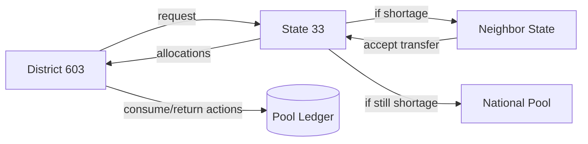

# ESCALATION LIFECYCLE REPORT

Generated: 2026-02-22T09:08:45.033648Z
Verdict: **PASS**

## Architecture Diagram



## Escalation Decision Tree

- District stock available -> allocate district
- Else state stock available -> allocate state
- Else accepted neighbor transfer available -> allocate neighbor_state
- Else national stock available -> allocate national
- Else record unmet

## Ledger Flow

- Solver debits source stocks via refill ledger entries.
- Consumables can be consumed and are blocked from return.
- Non-consumables return to origin pools based on allocation provenance.

## Final Verdict Table

| Phase | Name | Verdict |
|---|---|---|
| P0 | Clean slate reset | PASS |
| P1 | Class rule enforcement | PASS |
| P2 | Source pool tracking schema | PASS |
| P3 | Forced shortage setup | PASS |
| P4 | Request + solver run escalation chain | PASS |
| P5 | Consumable flow | PASS |
| P6 | Non-consumable return flow | PASS |
| P7 | Escalation UI verification (code-level) | PASS |

## Before/After Examples

```json
{
  "stock_after_setup": {
    "district": {
      "R5": 0.0,
      "R8": 0.0,
      "R41": 0.0
    },
    "state": {
      "R5": 500000000.0,
      "R8": 0.0,
      "R41": 0.0
    },
    "neighbor_state": {
      "R5": 0.0,
      "R8": 5000000.0,
      "R41": 0.0
    },
    "national": {
      "R5": 0.0,
      "R8": 0.0,
      "R41": 5000000.0
    }
  },
  "allocation_sources": {
    "R5": {
      "allocated": 400.19392,
      "source_scope": "state",
      "source_code": "33",
      "supply_level": "state",
      "origin_state_code": "33"
    },
    "R8": {
      "allocated": 4.1034243,
      "source_scope": "neighbor_state",
      "source_code": "1",
      "supply_level": "state",
      "origin_state_code": "1"
    },
    "R41": {
      "allocated": 1.0,
      "source_scope": "national",
      "source_code": "NATIONAL",
      "supply_level": "national",
      "origin_state_code": "NATIONAL"
    }
  },
  "consume_return": {
    "phase5": {
      "consume_performed": true,
      "consume_error": "",
      "c1_available": 400.19392,
      "return_blocked": true,
      "return_error": "Resource 'R5' is non-returnable and cannot be added to pool"
    },
    "phase6": {
      "checks": {
        "n1_origin_pool_increased": true,
        "n2_origin_pool_increased": true,
        "district_n1_unchanged": true,
        "district_n2_unchanged": true
      },
      "n1_available": 4.1034243,
      "n2_available": 1.0,
      "pool_before": {
        "neighbor_n1": 0.0,
        "national_n2": 0.0
      },
      "pool_after": {
        "neighbor_n1": 1.0,
        "national_n2": 1.0
      },
      "district_stock_before": {
        "N1": 0.0,
        "N2": 0.0
      },
      "district_stock_after": {
        "N1": 0.0,
        "N2": 0.0
      },
      "run_id": 1
    },
    "context": {
      "run_id": 1
    }
  }
}
```

## Invariant Proofs

- Consumable return blocked: verified by API error on return attempt.
- Non-consumable origin return: pool deltas increase at neighbor and national origins.
- Escalation chain: C1 from state, N1 from neighbor_state (accepted transfer), N2 from national.
- UI visibility: requests status, allocations source scope, unmet tab, agent recommendations confirmed in dashboard code.
